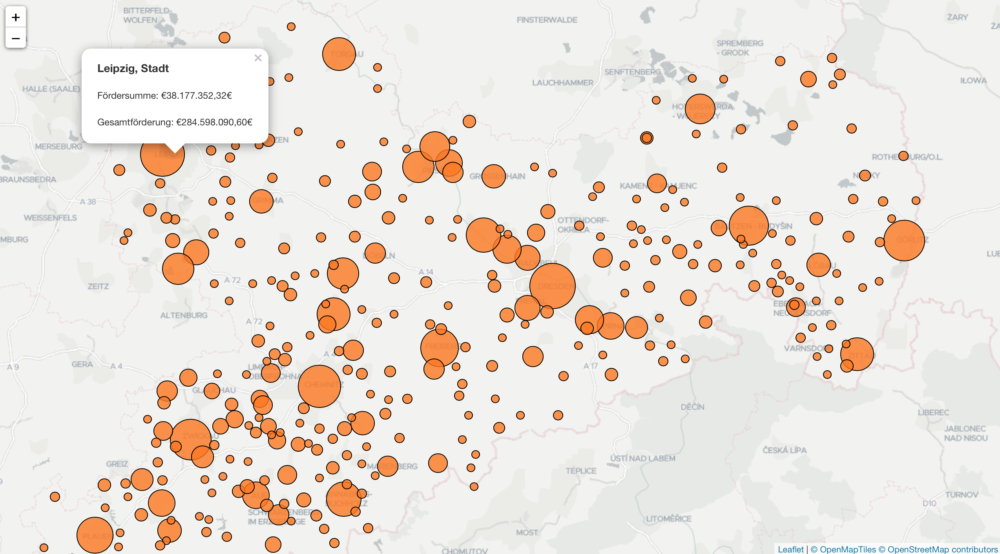

## Förderung von Projekten durch die EU in Sachsen

Zu oft wird die EU als Sündenbock dargestellt, wenn "die da in Brüssel" mal wieder etwas entscheiden. Im Gegensatz dazu werden die lokalen Erfolge natürlich nur der hiesigen Regierung zu Gute geschrieben. Diesem Denken möchte ich entgegenhalten und veranschaulichen wo überall die EU und ihre Fördermittel Gutes tun. Unter [Strukturfonds in Sachsen](http://www.strukturfonds.sachsen.de) wird eine Liste mit allen von der EU geförderten Projekten veröffentlicht. Das Ziel dieses Projektes ist es diese Datei zu verarbeiten und möglichst anschaulich und einfach für jeden zugänglich zu machen.

### Vorbereitung
Da die daten keine wirklichen Geodaten enthalten, müssen diese erst generiert werden, was ein automatisches Update so wie eine Ausweitung auf andere Gebiet extrem erschwert.

1. Geocoding der einzelnen Städte etwa durch [gpsvisualizer](http://www.gpsvisualizer.com). Das geht, dank auch fehlender Postleitzahl nur mäßig gut und muss manuell nachgescheckt werden.
2. Das CSV enthält einige Zeilen mit Metainformationen die gelöscht werden müssen.
3. Das CSV in JSON umwandeln, z.B.: mit [csvjson](http://www.csvjson.com/csv2json)

### Klassifikation
Um die einzelnen Städte und Gemeinden miteinander vergleichen zu können, müssen wir sie in verschiedene Klassen einordnen. Theoretisch könnte man auch eine minimale und maximale Markergröße festlegen und dann prozentual die Markergröße daran orientieren. Allerdings unterschieden sich die Fördermengen zwischen den größeren und kleineren Städt so enorm, so dass nur ganz große und ganz kleine (und keine mittleren) Marker entstehen wurden. Für die Klassifikation verwenden wir jetzt den [Jenks-Algorithmus](https://de.wikipedia.org/wiki/Jenks-Caspall-Algorithmus) mit einer fixen Anzahl an Klassen (25).

### Probleme bei der Datenverarbeitung
1. Im Datensatz vom 30.06.2017 sind Zuwendungen enthalten die als **Durchführungsort des Vorhabens** *Sachsen* enthalten und zusätzlich keine Daten für **Gesamtbetrag der förderfähigen Ausgaben des Vorhabens** enthalten
2. Die Datenpunkte alleine sind nicht sofort auf einer Karte darstellbar, da sie lediglich einen Ort als Zeichenkette enthalten. Hier sollte dringend nachgebessert werden und zum Beispiel Latitude/Longitude des Zentrioden der Stadt- bzw. Kreisgeometrie, die Postleitzahl hinzugefügt oder auch ein Fremdschlüssel aus einem anderen Datensatz (etwa [Geodatenzentrum](http://www.geodatenzentrum.de/geodaten/gdz_rahmen.gdz_div?gdz_spr=deu&gdz_akt_zeile=5&gdz_anz_zeile=1&gdz_unt_zeile=14&gdz_user_id=0)) verwendet werden.

### Zukünftige Features
- Normalisierung der Zuwendungen durch Bevölkerung,  Wirtschaftsleistung oder ähnliches
- Erweiterung auf gesamtes EU Gebiet
- Anzeigen der jeweiligen Zuwendungen für Stadt
- Anzeigen der zusätzlichen Metainformatione, z.B.: Name des Begünstigten, Bezeichnung des Vorhabens
- Filtern der Zuwendungen nach:
  - Höhe der Zuwendung
  - Zeitraum, z.B.: Zuwendung von Mai - Juli 2016
  - Enthaltenem Schlüsselwort in der Beschreibung, z.B.: Weiterbildung
- Klassifikation
  - Auswahl anderer Klassifikationsalgorithmen
  - Auswahl an Klassen
- Analyse der Zuwendungen nach:
  - Gebiet
  - Bereich
- Optimierung des JSON (Dateigröße hoch durch lange Spaltennamen)

### Verwendete Bibliotheken
1. http://openexchangerates.github.io/accounting.js/
2. https://github.com/simogeo/geostats
3. http://leafletjs.com
